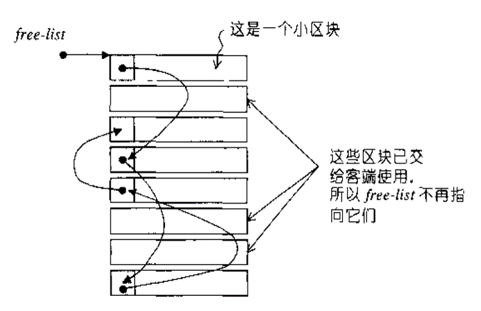

# Introduction

This project implements a custom memory allocator based on SGI's two-level strategy. Large allocation requests (>128 bytes) use `malloc/free` directly, while smaller requests access a memory pool with multiple free lists to reduce fragmentations and speed up allocations.

The file structure is as follows:
```txt
MemoryPool // directory
│  CMakeLists.txt
│  README.md
│
├─bin
│      libwinpthread-1.dll
│
├─figure
│      image1.png
│
└─src
        MemoryPool.h
        test.cpp
```
# Complie and Run
I recommend testing on Windows because the test on Linux does not perform as well as on Windows. On Windows, the speeds are comparable, but on Linux, the STL allocator is faster by a range from 1 to 3 times compared to the custom allocator. The test results on Linux are also less stable compared to those on Windows.

The `CMakeLists.txt` uses the O2 optimization to compile.
Use the following command to complie.
```
mkdir build
cd build
cmake ..
cmake --build . --config Release
```
The compiled program can be found in `build\Release\test.exe` when test on Windows or in `build\test` when test on Linux.


# Program Interfaces

## MemoryPool Class

- `static void* Allocate(std::size_t size)`
  - Allocates a block of memory of the specified size.
- `static void Deallocate(void* ptr, std::size_t size)`
  - Deallocates a previously allocated block.

The `MemoryPool` class provides static methods for memory allocation and deallocation. It is designed to manage memory efficiently by pooling memory blocks, reducing the overhead of frequent allocations and deallocations.

## Allocator<T> Class

- `pointer allocate(std::size_t n)`
  - Returns a pointer to a newly allocated block for n elements of type T.
- `void deallocate(pointer ptr, size_type n)`
  - Frees a block previously allocated for n elements of type T.
- `void construct(U* ptr, Args&&... args)`
  - Constructs an object of type U in the allocated memory.
- `void destroy(U* ptr)`
  - Destroys the object pointed to by ptr.

The `Allocator<T>` class is a custom allocator that uses the `MemoryPool` for memory management. It provides methods to allocate and deallocate memory for objects of type T, as well as to construct and destroy objects in the allocated memory.

# Test
I tested a custom memory allocator for vector operations at three different sizes (1000, 4000, 16000), randomly resizing 1/5 of the vectors. The assignment correctness was confirmed for both integer and pair elements. The output of a test on Windows is as follows:

```txt
vecints assignment correct: 746
vecpts assignment correct: 177
TestSize: 1000 | Allocator cost: 0.0050s
vecints assignment correct: 746
vecpts assignment correct: 177
TestSize: 1000 | std::allocator cost: 0.0050s
Custom allocator is 1.0000 times as fast as std::allocator for TestSize 1000

vecints assignment correct: 2072
vecpts assignment correct: 2309
TestSize: 4000 | Allocator cost: 0.0600s
vecints assignment correct: 2072
vecpts assignment correct: 2309
TestSize: 4000 | std::allocator cost: 0.0640s
Custom allocator is 1.0667 times as fast as std::allocator for TestSize 4000

vecints assignment correct: 7465
vecpts assignment correct: 4171
TestSize: 16000 | Allocator cost: 0.9190s
vecints assignment correct: 7465
vecpts assignment correct: 4171
TestSize: 16000 | std::allocator cost: 0.9700s
Custom allocator is 1.0555 times as fast as std::allocator for TestSize 16000
```

The output of tests on Linux is as follows:
```txt
// test1
vecints assignment correct: 366
vecpts assignment correct: 270
TestSize: 1000 | Allocator cost: 0.0029s
vecints assignment correct: 366
vecpts assignment correct: 270
TestSize: 1000 | std::allocator cost: 0.0008s
Custom allocator is 0.2690 times as fast as std::allocator for TestSize 1000

vecints assignment correct: 1979
vecpts assignment correct: 2947
TestSize: 4000 | Allocator cost: 0.0356s
vecints assignment correct: 1979
vecpts assignment correct: 2947
TestSize: 4000 | std::allocator cost: 0.0141s
Custom allocator is 0.3948 times as fast as std::allocator for TestSize 4000

vecints assignment correct: 5491
vecpts assignment correct: 4562
TestSize: 16000 | Allocator cost: 0.5810s
vecints assignment correct: 5491
vecpts assignment correct: 4562
TestSize: 16000 | std::allocator cost: 0.5553s
Custom allocator is 0.9557 times as fast as std::allocator for TestSize 16000
```

```txt
// test2
vecints assignment correct: 363
vecpts assignment correct: 347
TestSize: 1000 | Allocator cost: 0.0036s
vecints assignment correct: 363
vecpts assignment correct: 347
TestSize: 1000 | std::allocator cost: 0.0012s
Custom allocator is 0.3411 times as fast as std::allocator for TestSize 1000

vecints assignment correct: 2237
vecpts assignment correct: 2227
TestSize: 4000 | Allocator cost: 0.0355s
vecints assignment correct: 2237
vecpts assignment correct: 2227
TestSize: 4000 | std::allocator cost: 0.0172s
Custom allocator is 0.4844 times as fast as std::allocator for TestSize 4000

vecints assignment correct: 12878
vecpts assignment correct: 6409
TestSize: 16000 | Allocator cost: 0.5319s
vecints assignment correct: 12878
vecpts assignment correct: 6409
TestSize: 16000 | std::allocator cost: 0.2031s
Custom allocator is 0.3819 times as fast as std::allocator for TestSize 16000
```

# References

1. [STL C++ 标准模板库-11 迭代器 | 侯捷](https://www.youtube.com/watch?v=84U1Pkegm-M&list=PLTcwR9j5y6W2Bf4S-qi0HBQlHXQVFoJrP&index=11)
2. 《STL 源码剖析》侯捷
3. [SGI-STL V3.3 Source Code](https://github.com/steveLauwh/SGI-STL)

# Project Requirements

I add the final project requirements at the end.

## STL Allocator Interface

An allocator is used by standard library containers as a template parameter:

```cpp
template < class T, class Alloc = allocator<T> > class vector;
template < class T, class Alloc = allocator<T> > class list;
```

What does an allocator class have? Typically, it possesses:

```cpp
typedef void _Not_user_specialized;
typedef _Ty value_type;
typedef value_type *pointer;
typedef const value_type *const_pointer;
typedef value_type& reference;
typedef const value_type& const_reference;
typedef size_t size_type;
typedef ptrdiff_t difference_type;
typedef true_type propagate_on_container_move_assignment;
typedef true_type is_always_equal;

pointer address(reference _Val) const _NOEXCEPT
const_pointer address(const_reference _Val) const _NOEXCEPT
void deallocate(pointer _Ptr, size_type _Count)
_DECLSPEC_ALLOCATOR pointer allocate(size_type _Count)
template<class _Uty> void destroy(_Uty *_Ptr)
template<class _Objty, class _Types>
void construct(_Objty *_Ptr, _Types&&... _Args)
```

The above interface is just shown for illustration, please refer to [std::allocator](https://en.cppreference.com/w/cpp/memory/allocator) for the latest specification.

## Memory Pool

STL provides you a default [std::allocator](https://en.cppreference.com/w/cpp/memory/allocator), but you can implement your own to replace it. For example, you can design a memory pool to speed up the dynamic allocation of a large number of small blocks (e.g., 8 bytes, 16 bytes, ...), and to reduce memory fragmentation.



Figure 1: Mem pool using block based allocation strategy.

## Requirements

Implement your own memory allocator for STL vector.

- The allocator should optimize the memory allocation speed using memory pool.
- The allocator should support arbitrary memory size allocation request.

## How to Test Your Allocator

Basically, you should:

1. Create more than ten thousand vectors with different number of elements.
2. Pick up 1000 random vectors and resize the vectors with random sizes.
3. Release all the vectors.

Feel free to extend the following code skeleton for your own tests (good test is a bonus):

```cpp
#include <iostream>
#include <random>
#include <vector>

// include header of your allocator here
template<class T>
using MyAllocator = std::allocator<T>; // replace the std::allocator with your allocator
using Point2D = std::pair<int, int>;

const int TestSize = 10000;
const int PickSize = 1000;

int main()
{
  std::random_device rd;
  std::mt19937 gen(rd());
  std::uniform_int_distribution<> dis(1, TestSize);

  // vector creation
  using IntVec = std::vector<int, MyAllocator<int>>;
  std::vector<IntVec, MyAllocator<IntVec>> vecints(TestSize);
  for (int i = 0; i < TestSize; i++)
    vecints[i].resize(dis(gen));

  using PointVec = std::vector<Point2D, MyAllocator<Point2D>>;
  std::vector<PointVec, MyAllocator<PointVec>> vecpts(TestSize);
  for (int i = 0; i < TestSize; i++)
    vecpts[i].resize(dis(gen));

  // vector resize
  for (int i = 0; i < PickSize; i++)
  {
    int idx = dis(gen) - 1;
    int size = dis(gen);
    vecints[idx].resize(size);
    vecpts[idx].resize(size);
  }

  // vector element assignment
  {
    int val = 10;
    int idx1 = dis(gen) - 1;
    int idx2 = vecints[idx1].size() / 2;
    vecints[idx1][idx2] = val;
    if (vecints[idx1][idx2] == val)
      std::cout << "correct assignment in vecints: " << idx1 << std::endl;
    else
      std::cout << "incorrect assignment in vecints: " << idx1 << std::endl;
  }
  {
    Point2D val(11, 15);
    int idx1 = dis(gen) - 1;
    int idx2 = vecpts[idx1].size() / 2;
    vecpts[idx1][idx2] = val;
    if (vecpts[idx1][idx2] == val)
      std::cout << "correct assignment in vecpts: " << idx1 << std::endl;
    else
      std::cout << "incorrect assignment in vecpts: " << idx1 << std::endl;
  }

  return 0;
}
```

## Evaluation Standard

1. C++ code quality (clean, compact and reasonable)
2. Comments quality
3. Correctness and running performance of the allocator

## Files to Submit

Please prepare a .zip package including the following items:

1. The source code (including the testing code)
2. Makefile (for Mac or Linux users) or .exes (for Windows users, with necessary .dlls if you use MinGW) or CMakeLists.txt
